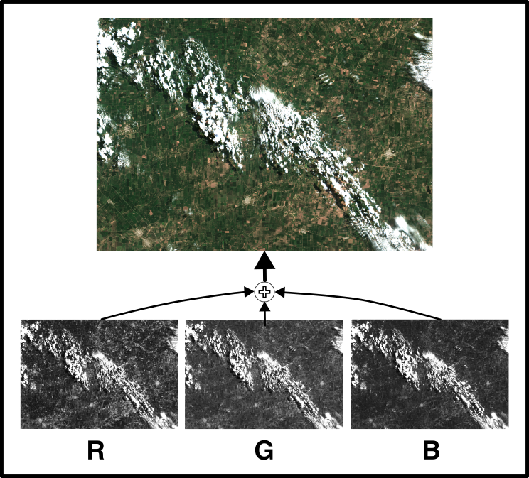

Laboratorio IV Sistemas Operativos 2 
### Ingeniería en Computación - FCEFyN - UNC
# Memoria compartida

## Introducción
Los niveles de integración electrónica han permitido la generación de procesadores de arquitecturas multiprocesos, multicore, híbridos y ahora many integrated core (MIC). Este avance hace necesario que los programadores cuenten con un profundo conocimiento del hardware sobre el que se ejecutan sus programas, y que dichos programas ya no pueden ser monoproceso (cambioo de paradigma).

Entre las técnicas y estándares más utilizados para sistemas de memoria compartida y memoria distribuida, se encuentra OpenMP y MPI respectivamente.

## Objetivo
El objetivo del presente trabajo práctico es que el estudiante sea capaz diseñar una solución que utilice el paradigma de memoria distribuida, utilizando OpenMP, en lenguaje C, que logre maximimizar el performance y disminuir el tiempo de ejecución, de acuerdo al hardware disponible para hacerlo.

## Desarrollo

Se entrega un [archivo](https://drive.google.com/file/d/1uQYAZNlU2lIeRw2yqQuFdvkyCIhliZhy/view?usp=share_link) en formato _GeoTif_ de una imágen del satélite *Sentinel 2* sobre el centro de la Provincia de Córdoba. Dentro de ese archivo, se encuentran los 3 canales RGB junto muchos metadatos de georeferenciamiento y sobre la captura. Los canales se presentan en matrices monocromàticas, una por canal, que juntos forman la imagen RGB composite que se muestra.

Existen numerosos algorimos de procesamiento de imágenes basados en convoluciones de la imagen con un kernel. Se pide que implemente un algoritmo que aplique un filtro de borde ([edge filter](https://en.wikipedia.org/wiki/Kernel_(image_processing))), tal como se detalla a continuación. 

La imagen filtrada se obtiene a partir de la convolución

$$ g(x, y) = \omega * f(x, y) = \sum_{dx=-a}^a \sum_{dy=-b}^b \omega(dx, dy)f(x-dx, y-dy) $$

Donde $g(x, y)$ es la imagen filtrada, $f(x, y)$ es la imagen original y $\omega$ es el kernel con límites $−a <= dx <= a$ y $−b <= dy <= b$.

### Restricciones
- Se implemente un programa en lenguaje C que posea como input las 3 matrices R, G y B.

- Que de salida tenga una imagen filtrada por canal de entrada.

- Las imágenes deben tratarse cono matrices em _M x N_, monocromática (una sola matriz por canal) y pueden utilizar la librarìa [gdal](https://gdal.org/) para abrir el GeoTiff, también pueden convertirlas en un formato amigable para la tarea (ej, [PGM](https://netpbm.sourceforge.net/doc/pgm.html)), o cualquier otro de su agrado.

- El diseño debe contemplar toda situación no descripta en el presente documento y se debe hacer un correcto manejo de errores.

- El diseño debe ser dinámico, y debe adaptarse a distintas imagenes de distintos tamañaos.

### Criterios de Corrección
- Se debe compilar el código con los flags de compilación: 
     -Wall -Pedantic -Werror -Wextra -Wconversion -std=gnu11
- La correcta gestion de memoria.
- Dividir el código en módulos de manera juiciosa.
- Estilo de código.
- Manejo de errores
- El código no debe contener errores, ni warnings.
- El código no debe contener errores de cppcheck.

## Entrega
Como metodología para resolver este problema, se solicita que, primero, se realice un diseño que sea solución al problema sin explotar el paralelismo (procedural), realizar métricas . Luego, a partir de este, realizar una nueva implementación que realice el proceso mediante el uso de la librería OpenMP, explotando el paralelismo del problema. Para ello, se requiere reconocer qué tipo de paralelismo exhibe el problema en cuestión y luego, diseñar la solución del mismo determinando cuáles son los datos/operaciones paralelizables. Se tendrá en cuenta, el nivel de paralelismo alcanzado.

La entrega se hace a travéz del repositorio de GitHub y se deberá demostrar la realizacion del mismo mediante un correcto uso. El repositorio deberá proveer los archivos fuente y cualquier otro archivo asociados a la compilación, archivos  de  proyecto  ”Makefile”  y  el  código correctamente documentado. No debe contener ningún archivo asociado a proyectos de un IDE y se debe asumir que el proyecto podrá ser compilado y corrido por una `tty` en una distribución de Linux con las herramientas típicas de desarrollo. También se deberá entregar un informe (que pude ser en MD en el repo) explicando paso a paso el desarrllo, inluyendo graficos del diseño solución propuesto, justificando en todo momento lo implementrado.
También se deberá investigar acerca de qué utilidades de profiling gratuitas existen y que brinda cada una (un capítulo del informe), optando por una para realizar las mediciones de tiempo de ejecución de la aplicación diseñada.

El informe (markdown) debe contener gráficos y análisis de comparación entre la ejecución procedural y la distribuida, mostrando la escalabilidad y el speedup del mismo (uno, dos, cuatro procesos, etc). El informe además debe contener el diseño de la solución y la comparativa de profilers.

## Links
- [Introduction to parallel programming](https://hpc.llnl.gov/documentation/tutorials/introduction-parallel-computing-tutorial)
- [OpenMP Tutorial](https://hpc-tutorials.llnl.gov/openmp/)
